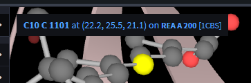

LiteMol Behaviour
=================

In LiteMol, very little functionality of the plugin is "hard-coded". Instead, static and dynamic *behaviours* are supported. This allows very high level
of customizability.

Static Behaviours
-----------------

Static behaviours are simply functions that subscribe to one or more events or commands and modify the actions LiteMol takes as a result. They
are specified at the plugin creation time as part of the plugin specification.

The default behaviors are

```TypeScript
[
    Bootstrap.Behaviour.SetEntityToCurrentWhenAdded,
    Bootstrap.Behaviour.FocusCameraOnSelect,                
    Bootstrap.Behaviour.ApplySelectionToVisual,
    Bootstrap.Behaviour.ApplyInteractivitySelection,
    Bootstrap.Behaviour.UnselectElementOnRepeatedClick,
    Bootstrap.Behaviour.Molecule.HighlightElementInfo,
    Bootstrap.Behaviour.Molecule.DistanceToLastClickedElement,
    Bootstrap.Behaviour.Molecule.ShowInteractionOnSelect(5)
]
``` 

As an example, let's look at the ``CreateVisualWhenModelIsAdded`` behaviour:

```TypeScript
export function CreateVisualWhenModelIsAdded(context: Context) {
    Event.Tree.NodeAdded.getStream(context).subscribe(e => {
        if (!Tree.Node.is(e.data, Entity.Molecule.Model) || (e.data as Entity.Any).isHidden) {
            return;
        } 
        let prms = Entity.Transformer.Molecule.CreateMacromoleculeVisual.info.defaultParams(context, e.data)!;
        Command.Tree.ApplyTransform.dispatch(context, { node: e.data, transform: Entity.Transformer.Molecule.CreateMacromoleculeVisual.create(prms) }) 
    });
}   
``` 

This behaviour subscribes the ``NodeAdded`` event. If the node is a molecule model, it automaticaly creates a visual representation of it by 
applying the appropriate transform.

A different example is providing highlight labels in the UI:



This works by adding a *highlight provider* to the context of the plugin and can be easily extended to provide labels for your custom data:

```TypeScript
export function HighlightElementInfo(context: Context) {        
    context.highlight.addProvider(info => {
        if (!Interactivity.Molecule.isMoleculeModelInteractivity(info)) return void 0;       
        let data = Interactivity.Molecule.transformInteraction(info);
        return Interactivity.Molecule.formatInfo(data);
    });        
}
```

Dynamic Behaviours
------------------

Dynamic behaviors work the same was as the static one with the exception that they are wrapped in a ``Behaviour`` entity. When the behaviour entity
is added to the state tree, the behavior is registered. As soon as the node is removed, the behavior is removed as well.

An example usage of a dynamic behavior is for example showing the electron density around a selected residue. This behavior
is only relevant when the density data is loaded and as such has a this "dynamic nature". You can view the source code
for the behaviour [here](https://github.com/dsehnal/LiteMol/blob/master/src/Bootstrap/Behaviour/ElectronDensity.ts) and
the way it is applied [here](https://github.com/dsehnal/LiteMol/blob/master/src/Viewer/PDBe/Data.ts).