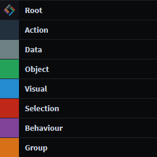
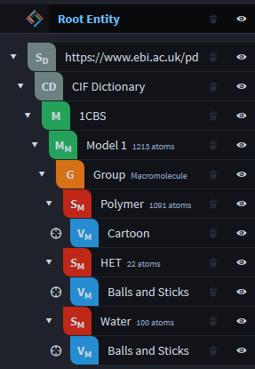

LiteMol State
=============

State in LiteMol is described by **entities** that can be **transformed** to form a **tree**.

*Note: code in this document is simplified for more clarity and will not work directly. For the 'actual' code please check the examples.*

Entities
--------

There are 8 classes of entities: 

```TypeScript
type TypeClass = 'Root' | 'Group' | 'Data' | 'Object' | 'Visual' | 'Selection' | 'Action' | 'Behaviour'
```

Each of the classes has a *semantic* value:

- **Root** - The root entity represents the starting point of all actions.
- **Action** - Represents a composition of one of more changes to the entity tree.
- **Data** - Low level data, for example a string or a CIF dictionary.
- **Object** - A more complex structure obtained from low level data. For example a molecule.
- **Visual** - A visual representation of an object.
- **Selection** - A description of a substructure of an object or a visual.
- **Behaviour** - Represents a dynamic behavior of the program. For example creating electron density surface when the selection changes.
- **Group** - A collection of related entities.

In the UI of LiteMol each of these classes is represented by a color:



Each type of an entity is then a member of a specific class and must specify a type of its properties.

Transforms
----------

The state in LiteMol changes by applying **transforms** to the **entities**.

Each transform has:

- Source entity type
- Target entity type
- Parameters 

So a transforms is a type:

```TypeScript
interface Transform<A extends Entity, B extends Entity, P> {
    apply(source: A, parameters: P): Promise<B>;
}
```

For example, downloading string data from a URL is a transform from the ``Root`` entity to the ``Data.String`` entity, with the parameter URL:

```TypeScript
class DownloadString implements Transform<Root, Data.String, { url: string }> {
    apply(source: Root, parameters: { url: string }) {
        return new Promise(resolve => {
            fetch(parameters.url)
                .then(data => resolve(Data.String.create({ parent: source, transform: this, data: data })))
        });
    }
}
```

Similarly, a transform that parses a string and returns a molecule representation would have the type:

```TypeScript
class CreateMoleculeFromString implements Transform<Data.String, Molecule, { format: string }>
```

Tree
----

Applying **transforms** to **entities** forms a tree structure. This is an example of how the tree looks like after downloading
string data, parsing it, and creating a molecule and its visual representation. 



Hopefully, to make this a bit more familiar, the entity tree can be described as XML:

```XML
<Root>
  <String>
    <CIFDictionary>
      <Molecule>
        <Model index='0'>
          <Group label='Macromolecule'>
            <Selection query='polymer'><Visual type='cartoon' /></Selection>
            <Selection query='het'><Visual type='balls and sticks' /></Selection>
            <Selection query='water'><Visual type='balls and sticks' /></Selection>
          </Group>
        </Model>
      </Molecule>
    </CIFDictionary>
  </String>
</Root>
```

It would be impractical to use XML within LiteMol to specify the state. So in order to create this tree, we need to *describe* a series of **transforms**
that are then applied by the runtime to form the **tree**:

```TypeScript
let t = createTransform();
let model = t
  // Add a new node as parent of plugin.root node.
  // Instead of plugin.root, a different node anywhere in the tree could be used as long as the types match
  .add(plugin.root, DownloadString, { url: 'https://www.ebi.ac.uk/pdbe/static/entry/1cbs_updated.cif' })
  // Apply another transform to the result of the previous one  
  .then(ParseCIF, { }) // ParseCIF maps a string to a CIF dictionary type, no parameters needed
  .then(CreateMoleculeFromMMCIF, { dataBlockIndex: 0 })
  .then(CreateMoleculeModel, { modelIndex: 0 });

let group = model.then(CreateGroup, { label: 'Macromolecule' });

group
  .then(CreateSelection, { query: 'polymer' })
  .then(CreateVisual, { type: 'cartoon' });

group
  .then(CreateSelection, { query: 'het' })
  .then(CreateVisual, { type: 'balls and sticks' });

group
  .then(CreateSelection, { query: 'water' })
  .then(CreateVisual, { type: 'balls and sticks' });

plugin.applyTransform(t);
```

### Events

When a transform is applied, a node is added/removed/updated, the LiteMol runtime raises an event that other parts of the application can react to.

### Transform Properties

In reality, each transform can also have *properties* as well as *parameters* that determine for example if the resulting entity is
visible in the tree or the *reference* to the particular entity.

For example, we could do something along the lines of:

```TypeScript
group.then(CreateSelection, { query: 'polymer' }, { ref: 'polymer-selection' })
```

Later in the code, we can reference this selection and apply different transforms to it:

```TypeScript
let t = createTransform();
t.add('polymer-selection', CreateVisual, { type: 'surface' });
plugin.applyTransform(t);
```

### Selecting Entities

LiteMol also introduces a selection language for the entities that is in a way similar to jQuery. It is possible to select subtrees, ancestors, entities of particular types, etc.

For example
```TypeScript
let query = Tree.Selection.byRef('polymer-selection').subtree();
```
selects all child nodes of the node with the ref ``polymer-selection``. This is then useful for example to highlight all such entities using the 
highlight command:

```TypeScript
let sel = plugin.context.select(query);
plugin.command(Command.Entity.Highlight, { entities: sel, isOn: true });
```

The command is then picked up by the relevant parts of the LiteMol plugin and the highlight is applied to the corresponding visuals.

This is all very nice, but why?
-------------

Why bother with such representation when in other program I can "simply" do something like this:

```JavaScript
fetch(url).then(data =>
    var molecule = parse(data);
    plugin.add(molecule);
    plugin.show('cartoons'); 
);
```

and be done with it. The reasons are these:

- For simple use cases, the above example is perfectly valid. However, as more and more functionality is being added to a software, it introduces higher complexity
  to the state and many solutions that look simple at first quickly become a mess of tangled spaghetti code full of complicated ``if`` conditions and other 
  complex constructs. The entity/transforms/tree system decomposes the app state to small building blocks that are somewhat loosely coupled and as a result
  make the app state manageable even when non-trivial functionality is added.
- The state of the application is *described* by the transforms and their parameters. So in order to restore the state of the plugin,
  it is just needed to re-apply the transforms and no other sophisticated serialization schemes like somehow storting the internal 
  representation of data are needed. Plus it's really space efficient, the state discussed above can be stored using just a few KB of data even if the
  molecule in question could several MB of data.   
